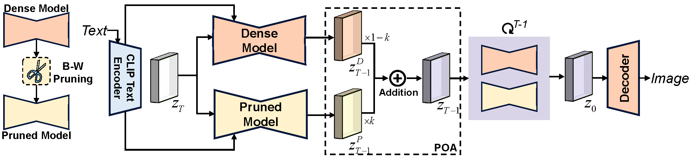
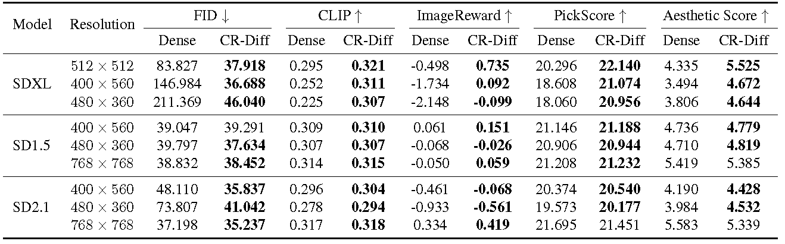
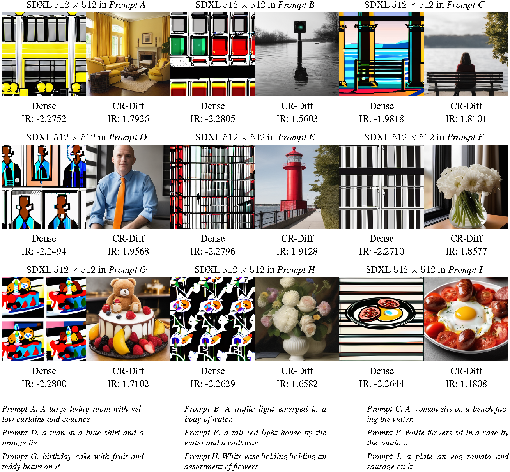

<div align="center">

<h1>Cross-Resolution Diffusion Models via Network Pruning</h1>
<h3><font color="#8B0000">Accepted by CVPR 2026 Findings</font></h3>

<a href="https://arxiv.org/abs/2510.06751">

<a href="https://alrightlone.github.io/OBS-Diff-Webpage/">

<a href="https://opensource.org/licenses/Apache-2.0">

</a>


**[Jiaxuan Ren](https://xuan9-9.github.io/)**<sup>2</sup>, **[Junhan Zhu](https://alrightlone.github.io/)**<sup>1</sup>, **[Huan Wang](https://huanwang.tech/)**<sup>1*</sup>

<sup>1</sup>Westlake University, <sup>2</sup>University of Electronic Science and Technology of China
<br>
*<sup>*</sup>Corresponding author: wanghuan [at] westlake [dot] edu [dot] cn*

</div>

<div align="left">
  
  <br>
  <em>
  This paper presents <strong>CR-Diff</strong>, a method to improve the cross-resolution visual consistency of UNet-based diffusion models by masking out some parameters in the model, i.e., network pruning. While pruning is traditionally used to reduce model size, here we repurpose it to help diffusion models generalize to unseen resolutions. The samples above compare the original SDXL model with its counterpart modified by CR-Diff. The original SDXL is trained at 1024×1024 resolution and can hardly generalize to other resolutions (e.g., 400×560, 480×360), whereas after CR-Diff prunes some parameters (the remaining parameters are unchanged), it generates much more coherent images at these unseen resolutions. This suggests that some parameters in UNet-based diffusion models may act like “impurities”, and pruning—which used to be considered harmful to model capacity—can actually purify the model and improve its cross-resolution generalization.
  </em>
</div>

<br>

## Introduction
Large-scale text-to-image diffusion models, while powerful, suffer from performance degradation when applied to unseen resolutions. Existing approaches primarily focus on architectural modifications or retraining, and fail to provide a simple, training-free solution to improve cross-resolution generalization. To bridge this gap, we present *CR-Diff*, a pruning-based framework that enhances the generative quality of diffusion UNets under resolution shifts.

Specifically,

1. We reveal a counterintuitive phenomenon that moderate pruning can improve generation quality, particularly at unseen resolutions, indicating that certain parameters beneficial at default resolutions may become adverse under distribution shifts;

2. To exploit this insight, we propose a block-wise pruning strategy that assigns differentiated sparsity ratios across downsampling, middle, and upsampling blocks, aligning pruning strength with their intrinsic functional importance;

3. Furthermore, we introduce a pruned output amplification mechanism that rebalances the outputs of dense and pruned subnetworks, enhancing beneficial signals while suppressing adverse effects, and supporting prompt-specific refinement for targeted improvements.

Extensive experiments demonstrate that  CR-Diff can improve perceptual fidelity and semantic coherence across various diffusion backbones and unseen resolutions, while largely preserving the performance at default resolutions. 

## Framework
<div align="left">
  
  <br>
  <em>Illustration of the proposed <i>CR-Diff</i> framework for improving cross-resolution generation in UNet-based diffusion models. The method follows a two-stage <i>pruning and optimizing</i> paradigm. First, target UNet blocks are assigned adaptive sparsity levels via a <i>block-wise pruning</i> strategy, where magnitude-based criteria are applied with differentiated ratios across downsampling, middle, and upsampling modules to extract resolution-stable parameter subsets. Subsequently, a <i>pruned output amplification</i> mechanism refines the denoising process by amplifying the pruned subnetwork outputs with a coefficient <i>k &gt; 1</i>, effectively suppressing adverse contributions from the dense model. This process leads to more stable denoising trajectories and produces higher-quality images with improved structural coherence and semantic alignment across resolutions.</em>
</div>

## Quantitative Results
<div align="left">
  
  <br>
  <em>Performance comparison on unseen resolutions. Across the evaluated models and resolutions, CR-Diff improves most metrics relative to the dense model, with <b>bold</b> values indicating superior performance of our CR-Diff against the dense model.</em>
</div>

## Qualitative Results
<div align="left">
  
  <br>
  <em>Cross-resolution comparison on a subset of 5K prompts from the MS-COCO 2014 validation set. CR-Diff shows consistent gains in both ImageReward and visual fidelity compared to the original SDXL. Dense denotes the original unpruned model. Each group corresponds to a specific prompt, and the ImageReward (IR) scores are shown below each image.</em>
</div>
<br>

---

This repository is a minimal, self-contained implementation of **CR-Diff** for reproducing our pruning and **Pruned Output Amplification (POA)** experiments. It is distilled from the original `Masking_Diffusion` codebase and keeps only:

- **Pruning configuration evaluation pipeline**: load pretrained diffusion models, apply structured UNet/DiT pruning, generate images, and compute metrics (FID / CLIP / ImageReward / PickScore / Aesthetic).
- **Lightweight evaluation scripts** under `evaluation/`.
- **Pruning core libraries** under `lib/`.
- **Simple single-image inference entry (POA-based)** under `POA_inference.py`.

The goal is to make it easy to reproduce CR-Diff’s pruning and evaluation results and to provide a simple entry to generate images from a text prompt.

## Quick Start

### 1. Installation

```bash
git clone https://github.com/xuan9-9/CR-Diff.git
cd CR-Diff

conda create -n crdiff python=3.10 -y
conda activate crdiff
pip install -r requirements.txt
```
You need to install the following diffusion models from Hugging Face (or have them cached locally):

- SD1.5: [`runwayml/stable-diffusion-v1-5`](https://huggingface.co/runwayml/stable-diffusion-v1-5)
- SD2.1: [`stabilityai/stable-diffusion-2-1`](https://huggingface.co/stabilityai/stable-diffusion-2-1)
- SDXL: [`stabilityai/stable-diffusion-xl-base-1.0`](https://huggingface.co/stabilityai/stable-diffusion-xl-base-1.0)
- SD3-Medium: [`stabilityai/stable-diffusion-3-medium-diffusers`](https://huggingface.co/stabilityai/stable-diffusion-3-medium-diffusers)
- FLUX: [`black-forest-labs/FLUX.1-dev`](https://huggingface.co/black-forest-labs/FLUX.1-dev) and [`black-forest-labs/FLUX.1-schnell`](https://huggingface.co/black-forest-labs/FLUX.1-schnell)

You also need an evaluation dataset:

- COCO 2014 (train/val + captions) if you want to reproduce the COCO-based experiments:
  - Images: `train2014/`, `val2014/` (see the [COCO official site](https://cocodataset.org/#home))
  - Captions: `annotations/captions_train2014.json`, `annotations/captions_val2014.json`

### 2. (Optional) Prepare COCO 5k subset

If you want to use the COCO 5k subset we used in the paper:

```bash
cd CR-Diff
python MSCOCO_pre_process/prepare_coco_5k.py
```

This will create:

- `data/val2014_samples/` – 5k sampled images
- `data/val2014_samples_prompts.csv` – prompts CSV compatible with the evaluation scripts

You can also prepare your own dataset as long as it follows the same CSV and naming conventions (see the **Data** section above).

### 3. Run BWP global search (find best ratios)

Run the Block-Wise Pruning Ratio Strategy (Simulated Annealing search):

```bash
cd CR-Diff
python BWP_strategy.py
```

After it finishes, you should get a config file like:

```text
outresults/SA_Ratio/sdxl_512x512/config.json
```

This file will be used by the subsequent pruning experiments and POA inference.

### 4. Run a UNet pruning experiment (single config)

You can either use the provided shell script:

```bash
cd CR-Diff
bash unet_pruning_experiment.sh
```

or call the Python script directly:

```bash
cd CR-Diff
python unet_pruning_experiment.py \
  --config_json outresults/SA_Ratio/sdxl_512x512/config.json \
  --prompt "A cat holding a sign that says hello world" \
  --prompt_tag demo
```

This will prune the UNet according to `best_global_params_ratio` in `config.json`, run an experiment, save logs and a demo image under `outresults/unet_experiment/`.

### 5. Run POA single-image inference

Finally, run POA inference for a single prompt:

```bash
cd CR-Diff
python POA_inference.py \
  --config_json outresults/SA_Ratio/sdxl_512x512/config.json \
  --prompt "A cat holding a sign that says hello world" \
  --output outputs/poa_sample.png \
  --poa_weight 1.5
```

Or use the minimal helper script:

```bash
cd CR-Diff
bash POA_inference.sh
```

You can then compare:

- Dense baseline: run `POA_inference.py` with `--no_prune`
- Pruned + POA: run with the BWP `config.json` and a non-zero `--poa_weight`

## Contact

If you have any questions, please contact us at [jiaxuan.ren@std.uestc.edu.cn](mailto:jiaxuan.ren@std.uestc.edu.cn).


